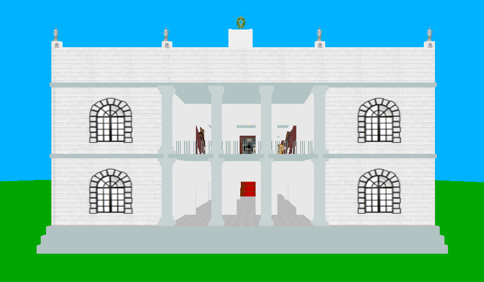
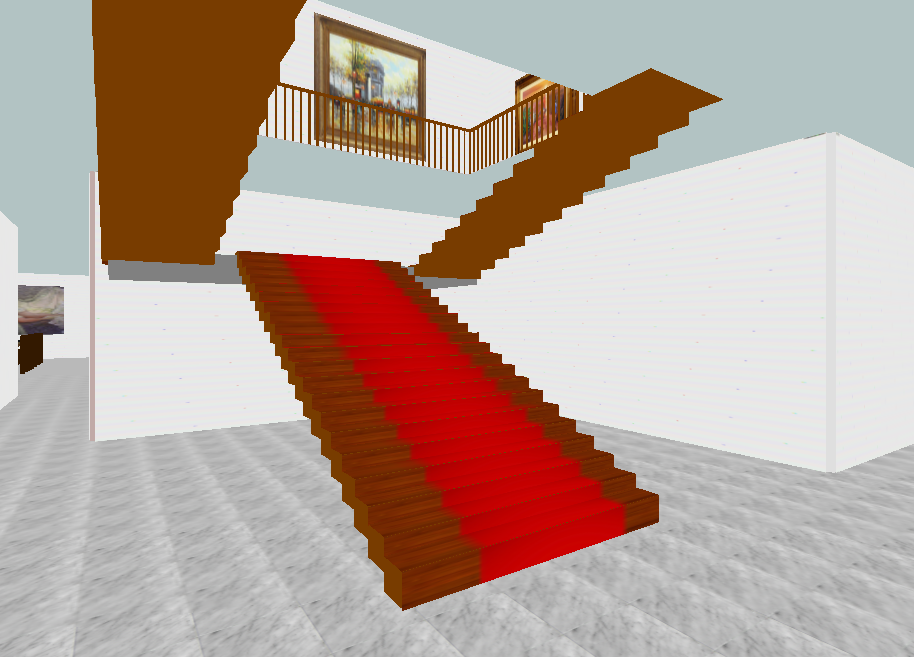
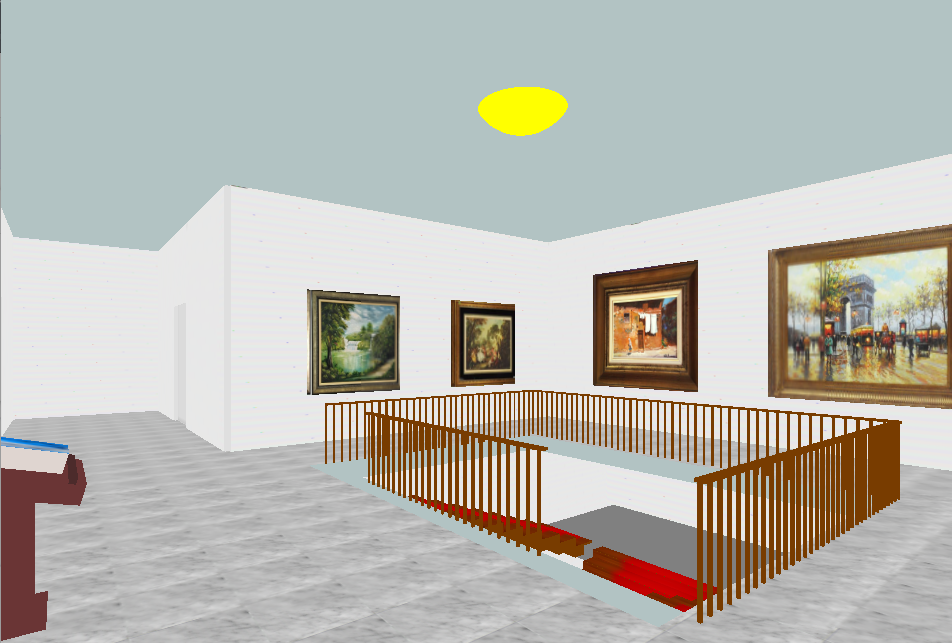
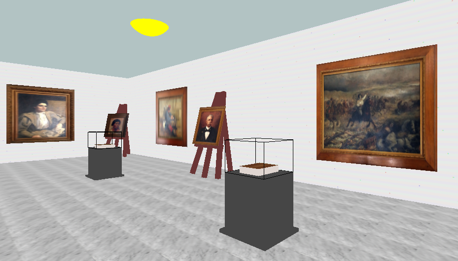

# Floriano Peixoto Palace Museum (MUPA)
3D Modeling project using OpenGL to show a walk-in simulation through the Floriano Peixoto Palace Museum.

#### Input keys for the application:
  - w -Move forward
  - s -Move Backward
  - a -Move left
  - d -Move right
  - Back space -Move vertically up
  - f -Move vertically down
  - Mouse left click and drag right -Rotate view towards right
  - Mouse left click and drag left  -Rotate view towards left

## Requirement
* OpenGL 2.0

## Compilation
#### Linux
```sh
git clone https://github.com/WagnerFLL/Computer-Graphics.git
g++ mupa.cpp -o mupa -lGL -lGLU -lglut -lsfml-graphics
./mupa
```

#### Windows:
```sh
git clone https://github.com/WagnerFLL/Computer-Graphics.git
g++ mupa.cpp -o mupa -lOpenGL32 -lfreeGLUT -lglu32 -IC:/mingw64/include
mupa.exe
```

## Screenshot





## Video
[](https://www.youtube.com/watch?v=Kitsk5SODSU)